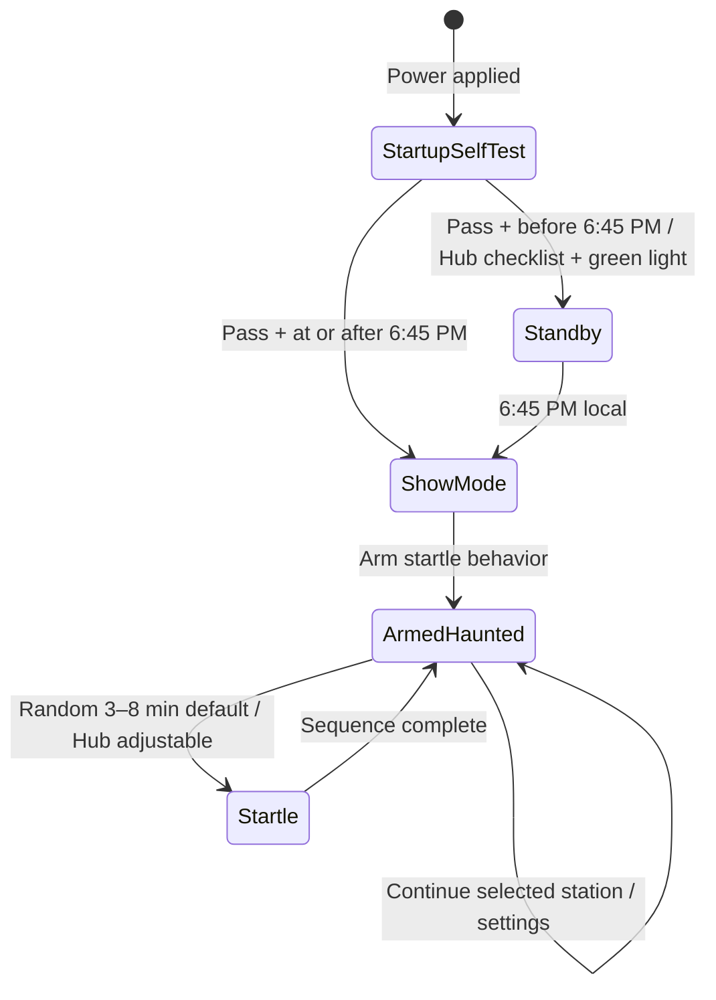

# HollowNet Scene-by-Scene Control Walkthrough

This walkthrough is the working control-map review for House in the Hollow. It covers every scene and room in the August 2026 registry, preserves the difference between installed equipment and planned infrastructure, and identifies where another room controller would add real value.

## Control layers

```text
HNA-26-CTL-003 HollowNet Main Hub
└── Zone Controller
    ├── Room or Area Controller — only when coordination justifies it
    └── Local Asset / HollowNet Field Node
```

A room controller is recommended when a scene has multiple coordinated effects, shared timing or safety interlocks, an actor control point, or several field nodes. A single self-contained effect can report directly to its zone controller or remain Local Only.

## Operations

### Control Room

| Record | Current state | Walkthrough decision |
| --- | --- | --- |
| `HNA-26-CTL-003` HollowNet Main Hub | Planned; Raspberry Pi 5 4GB hardware confirmed | Add active cooling, 5 V / 5 A supply, UPS/protected shutdown, wired network switch, MQTT service, operator interface and emergency-stop behavior. This remains the parent of every zone controller. |

## Exterior Grounds

Parent: `HNA-26-CTL-004` Exterior Grounds Zone Controller, planned and controlled by the Main Hub.

| Scene / room | Existing and planned assets | Current control | Recommended next step |
| --- | --- | --- | --- |
| Front Gate | `HNA-26-ANM-001` Front Gate — Built | Pneumatic motion and audio share the actor switch; switch remains local fallback | **Confirmed:** use `HNA-26-CTL-014` Front Gate Controller under `CTL-004`. Main Hub remote enable, test and emergency stop are required. Select the ESP32/industrial I/O, valve interface and sensing; validate de-energized valve vent/hold behavior before operation. |
| Bridge / Fountain | `HNA-26-LGT-001` Jack-O-Lanterns and `HNA-26-CTL-015` SimFlame Controller — Built | **Confirmed:** Garden Shed power automatically starts the SimFlame LV unit and its three 12 V AC flicker circuits | Keep local; Main Hub control is not required at this time. Record the Garden Shed source circuit or outlet label during electrical documentation. |
| Garden Shed | `HNA-26-ANM-002` Caretaker — Built | **Confirmed:** Garden Shed power starts its 12 V DC wiper motor and LED lantern; motion runs continuously | Keep local; no Main Hub control or dedicated HollowNet controller is required. The Garden Shed power feed also enables the Bridge/Fountain SimFlame controller. |
| Exterior Facade | `HNA-26-PRJ-001` Mia & Roy — Installed | **Confirmed:** Pi auto-starts the silent loop; projector currently starts manually; operation is local | Keep the planned direct link to `CTL-004`; no separate facade controller is required. Hub must show Pi-online and loop-running status and provide start, stop, restart-loop and reboot-Pi controls. Add automatic projector startup after identifying the projector's supported control method. |
| Queue | `HNA-26-SCN-006` Haunted Radio — Planned | **Confirmed:** Raspberry Pi 5 1GB is the primary controller; it can also run dial, lights and motor commands through interface hardware; ESP32 I/O is optional; `CTL-002` reports through `CTL-004` | Power-on self-test covers sound, lights and motor. Passing produces a Hub checklist and local green light. Before 6:45 PM enter standby; at/after 6:45 PM enter show mode immediately. Random startles default to 3–8 minutes, with live Hub adjustment for crowd size. Physical feedback sensors remain to be selected. |
| Shared property mist | `HNA-26-FOG-001` Arizona Mist System — Installed | **Confirmed:** one 120 V AC machine in the Tech Shed, started by manual switch; lines serve Bridge, Furnace Room, Bog and Graveyard; Furnace Room has two steam-simulation valves | Keep completely local. HollowNet is the documentation and maintenance record only: attach exact model/manual, plumbing map, valve labels and service instructions; log inspections, filter/nozzle/valve work, leaks, repairs and winterization. |

### Haunted Radio operating sequence



The local Pi owns the schedule and state machine so the radio still operates if the Hub link fails. The Hub can override modes, change schedule/settings, control volume and playback, run subsystem tests or a service startle, and view online, mode, playback and self-test status.

## Front House

Parent: `HNA-26-CTL-005` Front House Zone Controller, planned and controlled by the Main Hub.

| Scene / room | Existing and planned assets | Current control | Recommended next step |
| --- | --- | --- | --- |
| Facade Windows | `HNA-26-PRJ-002` Facade Windows — Planned | **Confirmed:** separate from Mia & Roy; approximately three to four silent projectors; local operation with no audio | Automatic media-loop startup on power is desired. Select projector count/models, player and synchronization method, then determine automatic projector startup. No Hub control is required. |
| Front Porch | `HNA-26-ANM-003` Rocking Chair — Built | **Confirmed:** 12 V DC wiper motor on a local timer-relay repeating loop | Keep completely local; no room controller or Hub control is required. Document the rocking/rest intervals and upstream power switch. |
| Reception Room | `HNA-26-ANM-004` Suit of Armor — Planned | **Confirmed:** ESP32 node under `CTL-005`; version one includes head and hand/arm movement on separate logic/servo supplies; randomized movement defaults to about every 45 seconds and is Hub-adjustable | Hub provides online/status/fault reporting plus enable, disable, individual movement tests and scene control. Select either actor button or motion sensor—not both. Weight shift remains a future option requiring stability safeguards. |

## Upper House

Parent: `HNA-26-CTL-006` Upper House Zone Controller, planned and controlled by the Main Hub.

| Scene / room | Existing and planned assets | Current control | Recommended next step |
| --- | --- | --- | --- |
| First Room | `HNA-26-SCN-001` Mrs. Grimm — Installed | **Confirmed:** Pi 4 is both scene and First Room controller; program auto-starts with Pi power; doorbell starts the complete 45-second lighting/audio/bass-shaker scene; button is locked out while running; automatic reset returns it to ready | Reports directly to `CTL-006`; duplicate `CTL-011` is retired. Hub-only status shows Pi online plus ready/running/fault and provides scene test/reset. No physical status light is required. |
| Reception Room | `HNA-26-SCN-002` Living Portrait — Installed | **Confirmed:** local BooBox; one actor-button press starts TV, fan and audio together for 30 seconds, followed by automatic reset; 12 V DC BooBox/fan and 120 V AC TV | Keep completely local. HollowNet stores reference material, notes and maintenance history only; no Hub controls or live status are required. Document active-scene re-trigger behavior. |
| Stair Hall | `HNA-26-ACT-001` Stair Hall Ghost and `HNA-26-ANM-005` Filing Cabinet — Installed | **Confirmed independent/local:** Ghost Pi program auto-starts with power; actor button starts the 35-second monitor/audio scene when ready; additional presses are ignored while running; automatic reset returns it to ready. A cabinet switch commands pneumatic open/close; an under-rug trundle switch triggers the pneumatic file pop-up | Do not add a Stair Hall room controller. Document Filing Cabinet pneumatic pressure/valve details. HollowNet is documentation/maintenance only. |
| Stair Hall / Sitting Room / Library / Gallery / Grand Hall | `HNA-26-PRJ-003` Storm — Installed | **Confirmed:** independent distributed projector/TV-monitor system; media loop starts automatically with power, but some projectors start manually | Keep local and separate from every room effect; no room-controller assignment. Document players, display map, synchronization, loop length and which projectors require manual startup. |
| Sitting Room | `HNA-26-ANM-006` Spiders — Installed | **Confirmed local continuous effect:** one manual switch powers both autoplay projector loops; a separate manual switch powers the continuously running 120 V motor and crank arm that raise and lower six articulated spiders on monofilament at different times and speeds | Keep completely local; no room controller is needed. Document projector/media-player models and motor rating. Add routine inspection of the crank, attachment points and monofilament. |
| Library | `HNA-26-SCN-003` Library Hanging Transformation — Installed | **Confirmed local 20-second scene:** hanging actor triggers it with a remote; lighting flashes on a reflected skeleton over the real actor, then changes to reveal the live actor as the actor drops; actor manually resets the scene after every run | Keep completely local with no Hub connection. Document lighting channels, remote type, power distribution, actor/drop equipment and the safe manual reset procedure. Add a pre-show physical safety inspection to the maintenance record. |
| Back Hall | `HNA-26-ANM-007` Back Hall Ghost — Installed | **Confirmed completely local continuous effect:** one master switch powers both the dedicated Pepper's Ghost light and the 12 V subtle-movement motor; the light and motor are not switched separately, and the motor runs continuously while powered | No room controller or Hub connection is needed. Document light voltage and motor mechanism. Add reflective surface, light, motor, linkage and mounting checks to maintenance. |
| Gallery | `HNA-26-SCN-004` Gallery Mirror and `HNA-26-OTH-001` George — Installed | **Confirmed separate operation:** actress behind mirror presses a local button to start the 30-second Mirror scene; Gallery lights go out, Mrs. Grimm video plays on the TV behind the mirror, lights restore, and the actress manually resets. The scene also cues the Grand Hall actor to slide the bookcase open. George is a seldom-used, manually operated puppet with microphone voice distortion | Do not combine them under a room controller. Keep the Mirror as its own local scene controller and George as a local puppet. Document the Grand Hall cue method/timing and George's microphone/audio power path. |
| Conservatory | `HNA-26-OTH-002` Possessed — Installed; `HNA-26-OTH-003` Possessed Levitation Effect — Planned | **Confirmed current effect:** local microphone and voice-distortion processor alter the live actress's voice; no other current outputs or Hub controls. **Planned:** add a separate levitation effect | Keep voice distortion completely local. Treat levitation as its own planned asset until the illusion or movement method, power, controller, trigger, duration, reset and safety requirements are selected. If it physically supports the actress, require engineering and operating-safety review before use. |
| Grand Hall | `HNA-26-VID-001` Grand Hall Eyes and `HNA-26-ANM-008` Grand Hall Chandeliers — Installed | Separate local operation | Strong room-controller candidate, especially if Storm joins the sequence. Document chandelier safety and decide the shared scene trigger. |

## Basement

Parent: `HNA-26-CTL-007` Basement Zone Controller, planned and controlled by the Main Hub.

| Scene / room | Existing and planned assets | Current control | Recommended next step |
| --- | --- | --- | --- |
| Pantry | `HNA-26-VID-002` Head in Basket and `HNA-26-VID-003` Head in Jar — Installed | Both report to Room Controller | Use `HNA-26-CTL-012` Pantry Room Controller under `CTL-007`; define common start, stop, ready and synchronized playback behavior. |
| Coal Cellar | `HNA-26-VID-004` Little Girl in Mirror — Installed | Raspberry Pi / Wi-Fi, Local Only | Connect the existing Pi directly to `CTL-007`; a separate room controller is unnecessary unless the Coal Cellar grows. |
| Furnace Room | `HNA-26-SCN-005` Furnace Room — Installed | Reports to Room Controller | Use `HNA-26-CTL-013` Furnace Room Controller under `CTL-007`. Document actor button, crackers, video, audio and mist-system interaction. |
| Dungeon | `HNA-26-PRJ-004` Dungeon Projection and `HNA-26-ANM-009` Trunk — Installed | Separate local operation | Strong room-controller candidate if the projection and trunk share a trigger or timing sequence. |
| Bone Room | `HNA-26-PRJ-005` Bone Room Creature — Installed | Media Player, Local Only | Connect directly to `CTL-007` when remote enable/test is needed; no room controller is required yet. |
| Last Room | `HNA-26-PRJ-006` Mrs. Grimm Ghost and `HNA-26-MTR-001` Moving Shade Light — Installed | Separate local operation | Strong room-controller candidate if projection and moving light are synchronized or actor-triggered together. |

## Cemetery

Parent: `HNA-26-CTL-008` Cemetery Zone Controller, planned and controlled by the Main Hub.

| Scene / room | Existing and planned assets | Current control | Recommended next step |
| --- | --- | --- | --- |
| Cemetery | `HNA-26-ANM-010` HDL Figures — Installed | Local Only | Document motor and lighting channels, then decide direct field-node control under `CTL-008`. Include the cemetery mist branch in the same scene review. |

## Bog

Parent: `HNA-26-CTL-001` Bog Zone Controller, planned and controlled by the Main Hub.

| Scene / room | Existing and planned assets | Current control | Recommended next step |
| --- | --- | --- | --- |
| Bog | `HNA-26-ANM-011` Mud Skeleton, `ANM-012` Crawler, `ANM-013` Coffin Skeleton and `ANM-014` Stake Skeleton — Planned | Four ESP32 field nodes planned under `CTL-001` | Confirm each mechanism, motor driver, power supply, limits/current protection and ambient/trigger behavior. The field nodes can report directly to the Bog controller; no extra room controller is currently needed. |

## Reserved future zones

| Zone | Controller | Current state | Walkthrough decision |
| --- | --- | --- | --- |
| Crypt | `HNA-26-CTL-009` Crypt Zone Controller | Planned placeholder; no assets assigned | Define the Crypt scenes and room names before creating child controllers or assets. |
| Out Back | `HNA-26-CTL-010` Out Back Zone Controller | Planned placeholder; no assets assigned | Define the Out Back scenes and room names before creating child controllers or assets. |

## Recommended walkthrough order

1. Exterior Grounds — Front Gate through Queue, including ownership of the shared mist system.
2. Front House — resolve the two facade definitions and Reception Room expansion.
3. Upper House — decide room controllers for Stair Hall, Gallery and Grand Hall.
4. Basement — finalize Pantry and Furnace Room, then decide Dungeon and Last Room.
5. Cemetery and Bog — define field-node hardware and outdoor networking.
6. Crypt and Out Back — create assets only after their room/scene lists are known.

For each scene, record five decisions before assigning hardware: trigger, outputs, safe/default state, local fallback, and parent controller.
